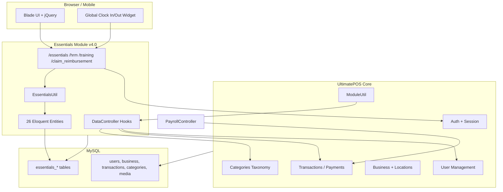
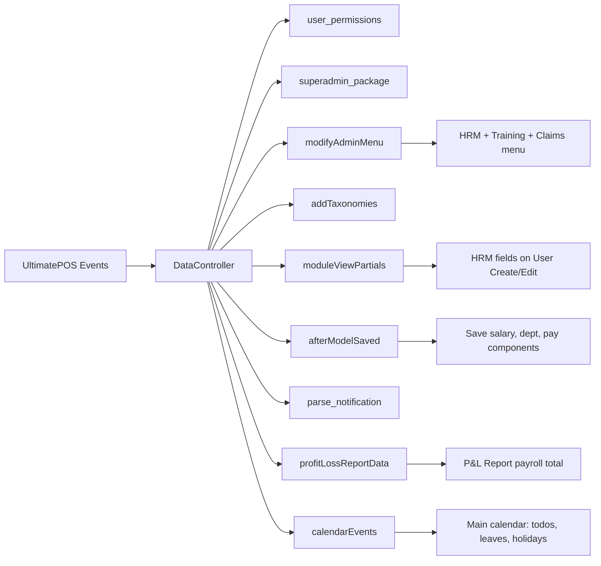
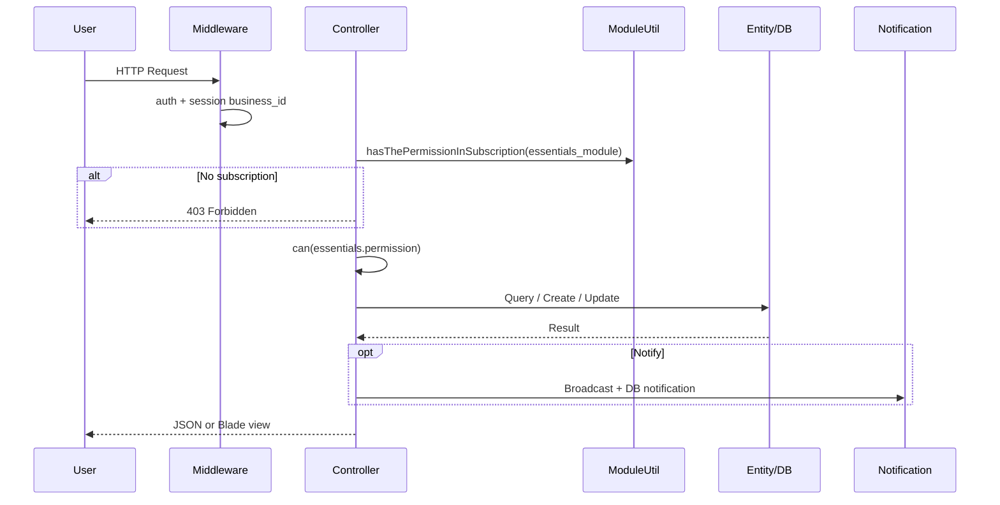
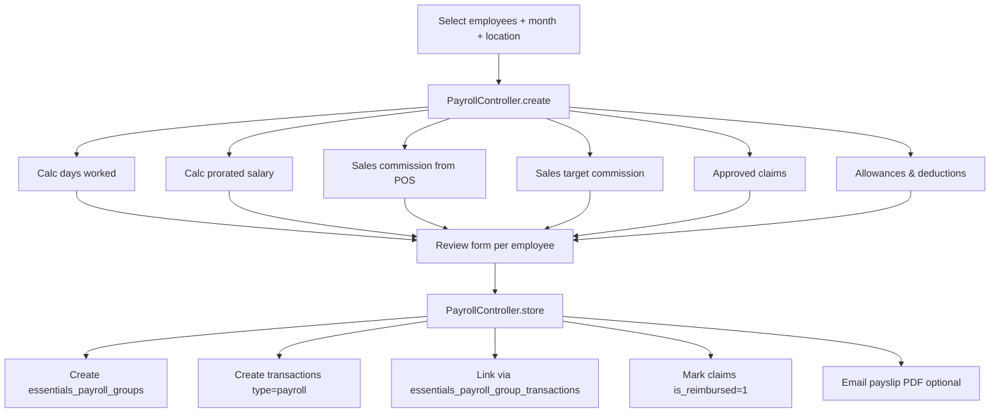
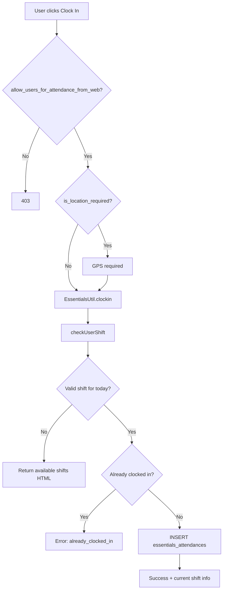
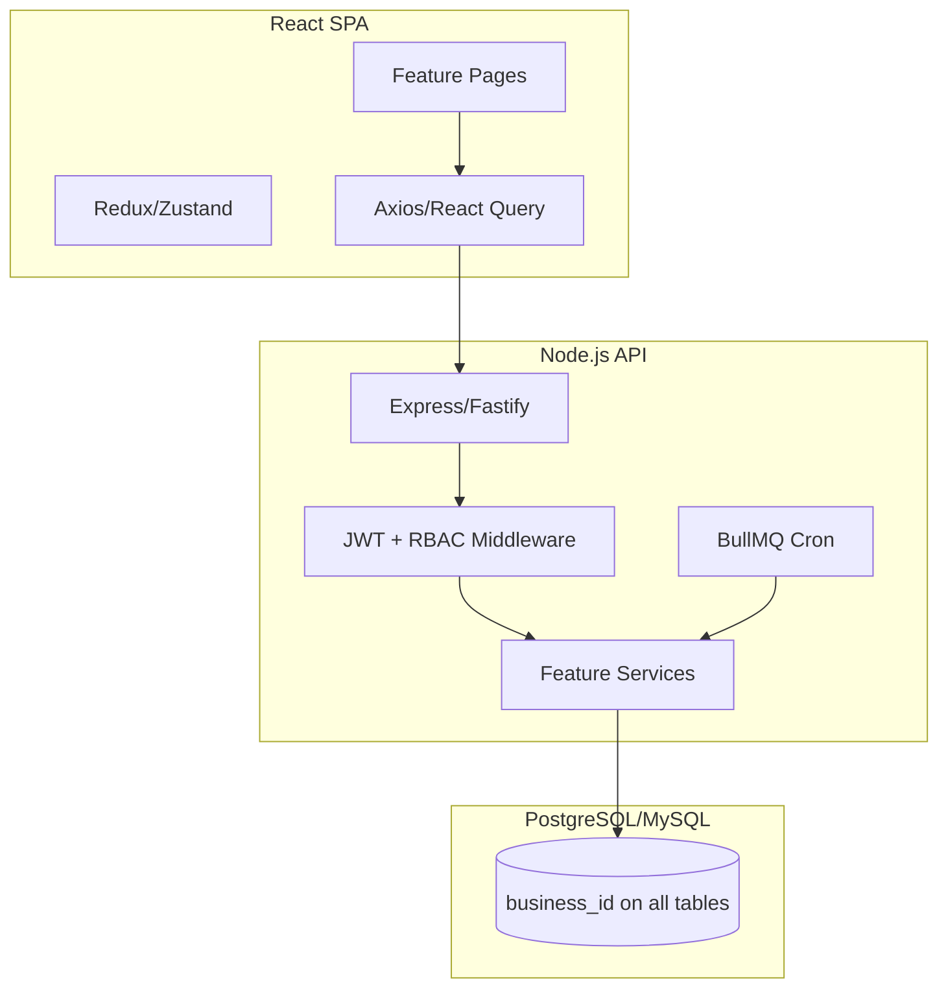

# Essentials & HRM Module — Complete Technical Documentation
**Version:** 4.0 | **Package:** `twf/essentials` | **Parent App:** UltimatePOS (Laravel ERP)

> **Purpose of this document:** Read this once and you should not need to open PHP/Blade code. Use it to brief AI for Node.js + React rebuild with admin UI screenshots.

---

## Table of Contents
1. [System Overview](#1-system-overview)
2. [Architecture & Block Diagrams](#2-architecture--block-diagrams)
3. [Shared / Parent Database Keys](#3-shared--parent-database-keys)
4. [Module Database Schema (All Tables)](#4-module-database-schema-all-tables)
5. [Permissions & Subscription Gates](#5-permissions--subscription-gates)
6. [Business Settings (JSON)](#6-business-settings-json)
7. [Feature Modules (Complete Detail)](#7-feature-modules-complete-detail)
8. [Core Business Logic & Formulas](#8-core-business-logic--formulas)
9. [Notifications & Emails](#9-notifications--emails)
10. [Scheduled Jobs](#10-scheduled-jobs)
11. [API Route Map (for React)](#11-api-route-map-for-react)
12. [Node.js + React Migration Blueprint](#12-nodejs--react-migration-blueprint)

---

## 1. System Overview

### What is this?
`Essentials` is **not** a standalone app. It is a **Laravel module** that plugs into **UltimatePOS** and adds:

| Area | Features |
|------|----------|
| **HRM** | Leave, Attendance, Shifts, Payroll, Holidays, Sales Targets, Activity Codes |
| **Essentials** | ToDo, Documents, Memos, Messages, Reminders, Knowledge Base |
| **Finance-linked** | Claims/Reimbursement, Allowances/Deductions (pay components) |
| **Training** | Role/designation-based training content |

### Multi-tenant model
- Every record is scoped by `business_id` (from session).
- Module must be enabled in subscription: `essentials_module`.
- Permissions are per-user via Spatie (`essentials.*`).

### Tech stack (current)
| Layer | Technology |
|-------|------------|
| Backend | Laravel (module), Eloquent ORM |
| Frontend | Blade + jQuery + Bootstrap + DataTables + FullCalendar |
| Auth | Parent app session + middleware |
| Payroll storage | Reuses parent `transactions` table (`type = payroll`) |
| Files | Laravel storage + `media` polymorphic table |

---

## 2. Architecture & Block Diagrams

### 2.1 High-level system architecture



### 2.2 Module integration hooks (DataController)



### 2.3 Request flow (typical feature)



### 2.4 Payroll data flow



### 2.5 Attendance clock-in flow



---

## 3. Shared / Parent Database Keys

These columns live on **parent app tables** but are **owned/used by Essentials**.

---

### 3.0 Common Keys Dictionary (Poore system mein baar-baar aane wale keys)

> **Pehle ye samjho** — baaki saari tables mein ye keys repeat hoti hain. Har jagah same meaning hai.

| Key | Type | Kis liye hai? (Simple Hindi) | Real-world example | Kahan filter hota hai |
|-----|------|------------------------------|--------------------|-----------------------|
| `id` | PK (auto increment) | Har row ka **unique number** — database ki pehchaan | Leave record #1042 | Primary key, URL mein `/leave/1042` |
| `business_id` | FK → `business.id` | **Company / Tenant ID** — kaunsi company ka data hai. Ek server par 100 companies ho sakti hain; har query mein `WHERE business_id = X` lagta hai taaki Company A ko Company B ka data na dikhe | `business_id = 5` → "ABC Traders Pvt Ltd" | Session se aata hai: `session('user.business_id')`. **Har Essentials table mein zaroori** |
| `user_id` | FK → `users.id` | **Employee / User ID** — kaun sa staff member. Login user ya koi aur employee | `user_id = 23` → "Rahul Sharma" | Leave applicant, attendance, message sender, todo assignee |
| `created_by` | FK → `users.id` | **Kis admin/employee ne record banaya** — audit ke liye | Payroll group banaya → `created_by = 1` (HR Manager) | Payroll groups, todos, training, KB articles |
| `location_id` | FK → `business_locations.id` | **Branch / Store / Office ID** — company ki kaunsi location. Ek company ke multiple branches hote hain | `location_id = 3` → "Mumbai Warehouse" | Holidays, payroll batch, messages (location-wise chat) |
| `role_id` | FK → `roles.id` | **User role** — Admin, Cashier, Manager etc. (Spatie permissions) | `role_id = 2` → "Manager" | Document share, training visibility |
| `ref_no` | string | **Reference number** — human-readable unique ID (invoice jaisa) | `LV-2024-0015`, `PR-2024-0089` | Leave, payroll — prefix settings se banta hai |
| `status` | string | **Record ki current state** — workflow step | `pending`, `approved`, `draft`, `final` | Leave, payroll group, training |
| `type` | string/int | **Category / classification** — same table mein alag-alag record types | Leave type: `0=paid, 1=unpaid`; Shift: `flexible_shift` | Context ke hisaab se alag meaning |
| `parent_id` | FK (self) | **Parent record** — tree/hierarchy ke liye. NULL = top level | KB article ka parent = section; claim sub-category ka parent = main category | Knowledge base, claim categories |
| `created_at` | timestamp | **Kab create hua** — system auto fill | `2024-06-15 10:30:00` | Audit, sorting, reports |
| `updated_at` | timestamp | **Last edit kab hui** | `2024-06-16 14:00:00` | Audit |
| `deleted_at` | timestamp nullable | **Soft delete** — record delete nahi, sirf hide. NULL = active | Non-null = deleted but recoverable | Leave types, leave balances |

#### Foreign Key (FK) kya hota hai?
- `user_id` → `users` table ki `id` column se link
- Matlab: is column mein sirf wahi number daal sakte ho jo `users` table mein exist karta ho
- **Join** karke naam laate hain: `users.first_name`, `users.essentials_salary`

#### Pivot table kya hoti hai?
- Do tables ko connect karti hai (many-to-many)
- Example: Ek todo **multiple users** ko assign → `essentials_todos_users` mein `todo_id` + `user_id` rows

#### JSON column kya hoti hai?
- Ek cell mein pura array/object store
- Example: `activity_codes = [1, 5, 9]` ya `essentials_allowances = [{name, amount}]`
- Node/React mein parse karke use karo

---

### `users` table (employee master — parent app + HRM extension)

> **Table role:** Login credentials + employee profile. Essentials isme extra HRM columns add karta hai.

| Column | Type | Kis liye hai? | Example / Values | Logic mein kahan use |
|--------|------|-------------|------------------|----------------------|
| `id` | PK | Employee ki unique ID | `23` | Har jagah `user_id` ke roop mein |
| `business_id` | FK | Kis company ka employee hai | `5` | Data isolation — sirf apni company dikhe |
| `surname`, `first_name`, `last_name` | string | Naam | "Sharma", "Rahul", "Kumar" | Payslip, lists, notifications |
| `email` | string | Login + attendance import match | `rahul@abc.com` | Excel import attendance by email |
| `essentials_department_id` | FK → categories | **Department** — HR, Sales, Accounts | `12` → "Sales" | Dashboard chart, payroll filter, payslip |
| `essentials_designation_id` | FK → categories | **Designation** — Manager, Executive, Driver | `18` → "Sales Executive" | Payslip, training filter |
| `essentials_salary` | decimal | **Monthly/base salary amount** (number only) | `25000.00` | Payroll: `salary / pay_period * days_worked` |
| `essentials_pay_period` | string | Salary **kis period ki hai** — divide karne ke liye | `month` / `week` / `day` | `25000/month` → daily rate nikalne ke liye |
| `essentials_pay_cycle` | string | **Pay cycle label** (display/reporting) | `monthly`, `bi-weekly` | Mostly informational |
| `location_id` | FK | **Primary work location / branch** | `3` → Mumbai branch | Holidays filter, payroll location, message room |
| `activity_codes` | JSON array | Kaunse **project/activity codes** is employee ko clock-in mein dikhne chahiye | `[1, 5, 9]` | Clock-in modal dropdown |
| `cmmsn_percent` | decimal | **POS sales commission %** — har sale par kitna % milega | `2.5` = 2.5% | Payroll allowance: sale commission |
| `joining_date` | date | **Joining date** | `2023-04-01` | HR records, reports |
| `exit_date` | date | **Last working day** (resigned/fired) | `2024-12-31` | Inactive employee tracking |
| `exit_reason` | text | Kyon chhoda | "Better opportunity" | HR audit |
| `bank_details` | text/JSON | Bank account (parent app) | Account no, IFSC | Payslip print |

---

### `transactions` table (payroll = expense transaction)

> **Table role:** UltimatePOS ki main money table. Payroll yahan `type = 'payroll'` ke saath store hota hai — alag payroll table nahi.

| Column | Type | Kis liye hai? | Example | Logic |
|--------|------|-------------|---------|-------|
| `id` | PK | Transaction unique ID | `5001` | Payslip, payment link |
| `business_id` | FK | Company | `5` | Tenant filter |
| `type` | string | **Transaction type** — payroll ke liye hamesha `'payroll'` | `payroll` | `WHERE type = 'payroll'` se sirf salary records |
| `expense_for` | FK → users.id | **Kis employee ki salary hai** | `23` | Employee payroll list |
| `transaction_date` | date | **Kis mahine ki salary** — hamesha month ka 1st day | `2024-06-01` = June 2024 payroll | Duplicate check: same employee + same month |
| `ref_no` | string | Payslip reference number | `PR-2024-0067` | Prefix: `payroll_ref_no_prefix` setting |
| `final_total` | decimal | **Net salary** (take-home after all calc) | `28500.00` | Payment, P&L report |
| `payment_status` | string | **Payment hui ya nahi** | `paid` / `due` / `partial` | HR payment tracking |
| `essentials_duration` | decimal | Kitne **din/ghante** kaam kiya (payroll period) | `22` days | Payslip display |
| `essentials_duration_unit` | string | Duration ki **unit** | `days` / `hours` | Label on payslip |
| `essentials_amount_per_unit_duration` | decimal | **Per day/hour rate** | `1136.36` per day | Manual payroll edit |
| `essentials_unit_salary` | decimal | **Snapshot** of unit salary at payroll time | `25000` | Historical — salary badle to purani payslip same rahe |
| `essentials_allowances` | JSON | **Allowance line items** array | `[{name:"HRA",amount:5000},{name:"Commission",amount:2000}]` | Payslip earnings section |
| `essentials_deductions` | JSON | **Deduction line items** array | `[{name:"PF",amount:1800}]` | Payslip deductions section |
| `location_id` | FK | Kis branch ki payroll | `3` | Location-wise payroll report |

---

### `business` table (company master)

| Column | Type | Kis liye hai? | Example | Logic |
|--------|------|-------------|---------|-------|
| `id` | PK | **Company ID** = `business_id` everywhere | `5` | Tenant root |
| `name` | string | Company ka naam | "ABC Traders" | Payslip header |
| `essentials_settings` | JSON | **Saari HRM settings ek jagah** | `{"leave_ref_no_prefix":"LV","grace_before_checkin":15}` | Session mein load, har feature padhta hai |
| `fy_start_month` | int | **Financial year start month** (1-12) | `4` = April | YTD payroll calculation |

---

### `business_locations` table (branches)

| Column | Type | Kis liye hai? | Example | Logic |
|--------|------|-------------|---------|-------|
| `id` | PK | Branch ID = `location_id` | `3` | |
| `business_id` | FK | Kis company ki branch | `5` | |
| `name` | string | Branch naam | "Delhi Office" | Dropdown, payslip |
| `landmark`, `city`, `state` | string | Address | | Payslip header |

---

### `categories` table (departments & designations)

| Column | Type | Kis liye hai? | Example | Logic |
|--------|------|-------------|---------|-------|
| `id` | PK | Category ID | `12` | `essentials_department_id` points here |
| `business_id` | FK | Company | `5` | |
| `name` | string | Naam | "Human Resources" | UI display |
| `category_type` | string | **Kis type ki category** | `hrm_department` / `hrm_designation` | Filter: sirf HR categories dikhao |

---

### `media` table (file attachments — parent app)

| Column | Type | Kis liye hai? | Example | Logic |
|--------|------|-------------|---------|-------|
| `id` | PK | File record ID | `88` | |
| `business_id` | FK | Company | `5` | |
| `file_name` | string | Stored filename | `doc_abc.pdf` | Download |
| `model_type` | string | Kis model se linked (polymorphic) | `Modules\Essentials\Entities\ToDo` | |
| `model_id` | int | Us model ki `id` | `15` = todo #15 | Todo documents |

---

### `system` table (module install tracking)

| Column | Type | Kis liye hai? | Example | Logic |
|--------|------|-------------|---------|-------|
| `key` | string | Property name | `essentials_version` | |
| `value` | string | Property value | `4.0` | Install/update check |

---

## 4. Module Database Schema (All Tables)

> **Note:** Migrations are not included in this download; schema is inferred from entities + controllers.

### 4.1 `essentials_attendances`
**Purpose:** Daily clock-in/out records per employee.

| Column | Type | Description |
|--------|------|-------------|
| `id` | PK | |
| `business_id` | FK | Tenant |
| `user_id` | FK → users | Employee |
| `essentials_shift_id` | FK → essentials_shifts | Shift at clock-in |
| `essentials_activity_log` | FK → essentials_activity_logs | Activity/project code |
| `clock_in_time` | datetime | |
| `clock_out_time` | datetime nullable | NULL = still clocked in |
| `clock_in_note` | text | |
| `clock_out_note` | text | |
| `clock_in_location` | string | GPS coords if required |
| `clock_out_location` | string | |
| `ip_address` | string | |
| `created_at`, `updated_at` | timestamps | |

**Logic:** One open attendance per user (`clock_out_time IS NULL`). Work duration = `TIMESTAMPDIFF(MINUTE, clock_in, clock_out)`.

---

### 4.2 `essentials_shifts`
**Purpose:** Shift definitions (timing, weekly offs, auto clock-out).

| Column | Type | Description |
|--------|------|-------------|
| `id` | PK | |
| `business_id` | FK | |
| `name` | string | Shift name |
| `type` | string | `fixed` / `flexible_shift` |
| `start_time` | time | |
| `end_time` | time | |
| `holidays` | JSON array | Weekly off days e.g. `["sunday","saturday"]` |
| `is_allowed_auto_clockout` | boolean | |
| `auto_clockout_time` | time | Used by scheduled job |

---

### 4.3 `essentials_user_shifts`
**Purpose:** Assign shifts to employees for date ranges.

| Column | Type | Description |
|--------|------|-------------|
| `id` | PK | |
| `user_id` | FK | |
| `essentials_shift_id` | FK | |
| `start_date` | date | Assignment start |
| `end_date` | date nullable | NULL = ongoing |

---

### 4.4 `essentials_activity_logs`
**Purpose:** Activity/project codes for attendance tracking.

| Column | Type | Description |
|--------|------|-------------|
| `id` | PK | |
| `business_id` | FK | |
| `activity_name` | string | Display name |
| `activity_code` | string | Short code |

---

### 4.5 `essentials_leave_types`
**Purpose:** Master leave types (paid/unpaid, limits).

| Column | Type | Description |
|--------|------|-------------|
| `id` | PK | |
| `business_id` | FK | |
| `leave_type` | string | Name e.g. "Casual Leave" |
| `max_leave_count` | int | Max balance |
| `type` | int | `0` = paid, `1` = unpaid |
| `leave_count_interval` | string | `month` / `year` / null |
| `deleted_at` | timestamp | Soft delete |

---

### 4.6 `essentials_leaves`
**Purpose:** Leave applications.

| Column | Type | Description |
|--------|------|-------------|
| `id` | PK | |
| `business_id` | FK | |
| `user_id` | FK | Applicant |
| `essentials_leave_type_id` | FK | |
| `start_date` | date | |
| `end_date` | date | |
| `reason` | text | |
| `status` | string | `pending` / `approved` / `cancelled` |
| `ref_no` | string | Auto-generated with prefix |
| `status_note` | text | Approver note |
| `changed_by` | FK → users | Who changed status |
| `change_id` | int | Audit reference |

**Activity log:** Spatie logs all attribute changes.

---

### 4.7 `essentials_user_leave_and_deductions`
**Purpose:** Per-user leave balance per leave type.

| Column | Type | Description |
|--------|------|-------------|
| `id` | PK | |
| `business_id` | FK | |
| `user_id` | FK | |
| `leave_id` | FK → essentials_leave_types | |
| `balance` | decimal | Remaining leave days |
| `deleted_at` | timestamp | Soft delete |

**Logic:** Balance deducted **on apply** (pending), restored if **cancelled**.

---

### 4.8 `essentials_user_leave_and_deductions_transactions`
**Purpose:** Audit trail of leave balance changes.

| Column | Type | Description |
|--------|------|-------------|
| `id` | PK | |
| `user_id` | FK | |
| `leave_type_id` | FK | |
| `deleted_at` | timestamp | |

---

### 4.9 `essentials_holidays`
**Purpose:** Company holidays / days off.

| Column | Type | Description |
|--------|------|-------------|
| `id` | PK | |
| `business_id` | FK | |
| `name` | string | |
| `start_date` | date | |
| `end_date` | date | |
| `location_id` | FK nullable | NULL = all locations |
| `note` | text | |

---

### 4.10 `essentials_allowances_and_deductions`
**Purpose:** Pay components (recurring allowances/deductions).

| Column | Type | Description |
|--------|------|-------------|
| `id` | PK | |
| `business_id` | FK | |
| `description` | string | Label |
| `type` | string | `allowance` / `deduction` |
| `amount` | decimal | |
| `amount_type` | string | `fixed` / `percent` |
| `applicable_date` | date nullable | If set, cannot unassign from user |

---

### 4.11 `essentials_user_allowance_and_deductions` (pivot)
| Column | Description |
|--------|-------------|
| `user_id` | FK |
| `allowance_deduction_id` | FK |

---

### 4.12 `essentials_claim_reimbursement`
**Purpose:** Employee expense claims.

| Column | Type | Description |
|--------|------|-------------|
| `id` | PK | |
| `business_id` | FK | |
| `description` | string | |
| `type` | string | allowance/deduction style |
| `amount` | decimal | |
| `amount_type` | string | `fixed` / `percent` |
| `document` | string | File path |
| `applicable_date` | date | |
| `claim_category_id` | FK | |
| `claim_sub_category_id` | FK nullable | |
| `is_approved` | boolean | |
| `is_reimbursed` | boolean | Set when added to payroll |
| `payroll_id` | FK nullable | Link to payroll transaction |
| `status_note` | text | |
| `change_id` | int | |

---

### 4.13 `essentials_user_claim_reimbursement` (pivot)
| Column | Description |
|--------|-------------|
| `user_id` | FK |
| `claim_reimbursement_id` | FK |

---

### 4.14 `essentials_claim_and_reimbursement_categories`
**Purpose:** Hierarchical claim categories.

| Column | Type | Description |
|--------|------|-------------|
| `id` | PK | |
| `business_id` | FK | |
| `name` | string | |
| `code` | string | |
| `parent_id` | FK nullable | NULL = parent category |

---

### 4.15 `essentials_payroll_groups`
**Purpose:** Batch payroll run header.

| Column | Type | Description |
|--------|------|-------------|
| `id` | PK | |
| `business_id` | FK | |
| `name` | string | Group name |
| `status` | string | `draft` / `final` |
| `payment_status` | string | Aggregated payment state |
| `gross_total` | decimal | Sum of employee payrolls |
| `location_id` | FK | |
| `created_by` | FK → users | |

---

### 4.16 `essentials_payroll_group_transactions` (pivot)
| Column | Description |
|--------|-------------|
| `payroll_group_id` | FK |
| `transaction_id` | FK → transactions |

---

### 4.17 `essentials_user_sales_targets`
**Purpose:** Tiered sales commission targets per employee.

| Column | Type | Description |
|--------|------|-------------|
| `id` | PK | |
| `user_id` | FK | |
| `target_start` | decimal | Sales range start |
| `target_end` | decimal | Sales range end |
| `commission_percent` | decimal | % if sales in range |

---

### 4.18 `essentials_to_dos`
**Purpose:** Task management.

| Column | Type | Description |
|--------|------|-------------|
| `id` | PK | |
| `business_id` | FK | |
| `created_by` | FK → users | |
| `task` | string | Title |
| `task_id` | string | Reference number (prefix from settings) |
| `date` | date | Start date |
| `end_date` | date | |
| `description` | text | |
| `estimated_hours` | decimal | |
| `priority` | string | `low`/`medium`/`high`/`urgent` |
| `status` | string | `new`/`in_progress`/`on_hold`/`completed` |

---

### 4.19 `essentials_todos_users` (pivot)
| Column | Description |
|--------|-------------|
| `todo_id` | FK |
| `user_id` | FK (assignees) |

---

### 4.20 `essentials_todo_comments`
| Column | Type | Description |
|--------|------|-------------|
| `id` | PK | |
| `task_id` | FK → essentials_to_dos | |
| `comment` | text | |
| `comment_by` | FK → users | |

---

### 4.21 `essentials_documents`
| Column | Type | Description |
|--------|------|-------------|
| `id` | PK | |
| `business_id` | FK | |
| `user_id` | FK | Uploader |
| `type` | string | `document` / `memos` |
| `name` | string | Filename or memo heading |
| `description` | text | |

---

### 4.22 `essentials_document_shares`
| Column | Type | Description |
|--------|------|-------------|
| `id` | PK | |
| `document_id` | FK | |
| `value_type` | string | `user` / `role` |
| `value` | int | user_id or role_id |

---

### 4.23 `essentials_messages`
**Purpose:** Location-based internal chat.

| Column | Type | Description |
|--------|------|-------------|
| `id` | PK | |
| `business_id` | FK | |
| `user_id` | FK | Sender |
| `location_id` | FK | Chat room = business location |
| `message` | text | |

**Polling:** Every `chat_refresh_interval` seconds (default 20).

---

### 4.24 `reminders` (table: `essentials_reminders` or `reminders`)
| Column | Type | Description |
|--------|------|-------------|
| `id` | PK | |
| `business_id` | FK | |
| `user_id` | FK | Owner |
| `name` | string | Event title |
| `date` | date | |
| `time` | time | Start |
| `end_time` | time | |
| `repeat` | string | `one_time`/`every_day`/`every_week`/`every_month` |

---

### 4.25 `essentials_kb` (KnowledgeBase)
| Column | Type | Description |
|--------|------|-------------|
| `id` | PK | |
| `business_id` | FK | |
| `created_by` | FK | |
| `title` | string | |
| `content` | longtext | HTML |
| `kb_type` | string | `knowledge_base`/`section`/`article` |
| `parent_id` | FK nullable | Tree structure |
| `share_with` | string | `public`/`only_with` |

---

### 4.26 `essentials_kb_users` (pivot)
| Column | Description |
|--------|-------------|
| `kb_id` | FK |
| `user_id` | FK |

---

### 4.27 `trainings`
| Column | Type | Description |
|--------|------|-------------|
| `id` | PK | |
| `business_id` | FK | |
| `role_id` | FK nullable | Share with role |
| `designation_id` | FK nullable | Share with designation |
| `title` | string | |
| `content` | longtext | WYSIWYG HTML |
| `attachment` | JSON array | File paths |
| `status` | string | |
| `created_by` | FK | |

---

### 4.28 `training_docs`
| Column | Description |
|--------|-------------|
| `training_id` | FK |
| (minimal model — files mainly in `attachment` JSON) |

---

## 5. Permissions & Subscription Gates

### Universal gate (every feature)
```
superadmin OR subscription.has('essentials_module')
```

### All `essentials.*` permissions

| Permission Key | Feature | Notes |
|----------------|---------|-------|
| `essentials.crud_leave_type` | Leave types CRUD | |
| `essentials.crud_all_leave` | Apply/view all employees' leave | Radio group `leave_crud` |
| `essentials.crud_own_leave` | Own leave only | Radio group `leave_crud` |
| `essentials.approve_leave` | Approve/reject leave | |
| `essentials.view_all_attendance` | See all attendance | Radio `view_all_attendance` |
| `essentials.view_own_attendance` | Own attendance only | Radio |
| `essentials.add_attendance` | Manual add | |
| `essentials.edit_attendance` | Edit records | |
| `essentials.delete_attendance` | Delete records | |
| `essentials.shift_transfer` | Defined but unused in controllers | |
| `essentials.allow_users_for_attendance_from_web` | Self clock-in from browser | |
| `essentials.allow_users_for_attendance_from_api` | Self clock-in from API | |
| `essentials.view_allowance_and_deduction` | View pay components | |
| `essentials.add_allowance_and_deduction` | CRUD pay components | |
| `essentials.approve_allowance_and_deduction` | Approve pay components | |
| `essentials.view_claim_reimbursement` | View claims | |
| `essentials.add_claim_reimbursement` | Create claims | |
| `essentials.approve_claim_reimbursement` | Approve claims | |
| `essentials.claim_reimbursement_category` | View categories | |
| `essentials.add_claim_reimbursement_category` | Manage categories | |
| `essentials.crud_department` | Departments taxonomy | |
| `essentials.crud_designation` | Designations taxonomy | |
| `essentials.view_all_payroll` | All payrolls | Without: own only |
| `essentials.create_payroll` | Create payroll | |
| `essentials.update_payroll` | Edit payroll | |
| `essentials.delete_payroll` | Delete payroll | |
| `essentials.create_message` | Send messages | |
| `essentials.view_message` | Read messages | |
| `essentials.access_sales_target` | Sales targets | |
| `essentials.add_holiday` | Create holiday | |
| `essentials.edit_holiday` | Edit holiday | |
| `essentials.delete_holiday` | Delete holiday | |
| `essentials.activity_log` | Activity codes CRUD | Not in user_permissions list |
| `essentials.add/edit/delete/assign_todos` | Todo permissions | Commented in registry, used in code |
| `training.view_training` | View single training | |
| `training.view_all_training` | All trainings | |
| `training.view_own_training` | Own role/designation trainings | |
| `training.create_training` | Create/edit training | |
| `training.delete_training` | Delete training | |

---

## 6. Business Settings (JSON)

Stored in `business.essentials_settings` (session key: `business.essentials_settings`):

| Key | Purpose | Used In |
|-----|---------|---------|
| `leave_ref_no_prefix` | Leave reference prefix | Leave create |
| `leave_instructions` | HTML shown on leave form | Leave UI |
| `payroll_ref_no_prefix` | Payroll ref prefix | Payroll store |
| `essentials_todos_prefix` | Todo task ID prefix | Todo create |
| `grace_before_checkin` | Minutes before shift start allowed | Clock-in validation |
| `grace_after_checkin` | Minutes after shift start allowed | Clock-in validation |
| `grace_before_checkout` | Minutes before shift end | Clock-out validation |
| `grace_after_checkout` | Minutes after shift end | Clock-out validation |
| `is_location_required` | GPS mandatory for clock-in/out | Attendance |
| `calculate_sales_target_commission_without_tax` | Use sales ex-tax for target commission | Payroll |

---

## 7. Feature Modules (Complete Detail)

---

### FEATURE 1: HRM Dashboard
**Route:** `GET /hrm/dashboard`  
**Controller:** `DashboardController@hrmDashboard`

#### UI screens
| Widget | Data Shown | Who Sees |
|--------|------------|----------|
| My Leaves | User's leave list | All |
| Sales Targets | This/last month achievement vs target bands | Employees with targets |
| Holidays | Upcoming holidays | All / location filtered |
| Department chart | User count by department | Admin |
| Today's leaves | Who is on leave today | Admin |
| Upcoming leaves | Next 30 days | Admin |
| Today's attendance | Who clocked in today | Admin |
| Sales targets table | All employees targets | Admin |

#### DB tables read
`users`, `categories`, `essentials_leaves`, `essentials_leave_types`, `essentials_holidays`, `essentials_attendances`, `essentials_user_sales_targets`, `transactions`

#### Logic
- Aggregates HR KPIs for quick admin view.
- Links to "My Payrolls" for employee self-service.

---

### FEATURE 2: Leave Types
**Route prefix:** `/hrm/leave-type`  
**Permission:** `essentials.crud_leave_type`

#### UI: Index table
| Column | DB Field |
|--------|----------|
| Leave Type | `leave_type` |
| Max Count | `max_leave_count` |
| Paid/Unpaid | `type` (0=paid) |
| Interval | `leave_count_interval` |

#### Create/Edit fields
- `leave_type`* — name
- `max_leave_count`* — annual/monthly cap
- `type`* — paid (0) or unpaid (1)
- `leave_count_interval` — `month` / `year` / none

#### Why
Defines leave policies. Balance stored separately per user in `essentials_user_leave_and_deductions`.

---

### FEATURE 3: Leave Management
**Route prefix:** `/hrm/leave`  
**Permissions:** `crud_all_leave` OR `crud_own_leave`, `approve_leave`

#### UI: Index filters
Employee, Status, Leave Type, Date range

#### UI: Index table
| Column | DB Field |
|--------|----------|
| Ref No | `ref_no` |
| Leave Type | join `essentials_leave_types.leave_type` |
| Employee | `users` |
| Date | `start_date` - `end_date` |
| Reason | `reason` |
| Status | `status` badge |

#### Create modal fields
- `essentials_leave_type_id`*
- `start_date`*, `end_date`*
- `reason`*
- Instructions HTML from settings

#### Status change modal
- `status`* — approved / cancelled
- `status_note`

#### Business logic flow
```
1. User selects leave type + dates
2. Calculate days = diff(start, end) + 1
3. IF leave type is PAID (type=0):
     Check essentials_user_leave_and_deductions.balance >= days
     IF insufficient → error
4. DB Transaction:
     a. Generate ref_no = prefix + sequence
     b. INSERT essentials_leaves (status=pending)
     c. Deduct balance immediately
     d. Notify all admins (NewLeaveNotification)
     e. Email manager (UserLeaveMail)
5. On approve/cancel (changeStatus):
     a. Update status, changed_by, status_note
     b. IF cancelled → restore balance to user
     c. Notify employee (LeaveStatusNotification + email)
```

#### Activity log
Spatie activity on `essentials_leaves` — viewable in activity modal.

---

### FEATURE 4: Attendance
**Route prefix:** `/hrm/attendance`  
**Permissions:** view_all/view_own, add/edit/delete, allow_users_for_attendance_from_web

#### UI tabs
1. **Shifts** — shift master list
2. **All Attendance** — full log + filters
3. **By Shift** — summary per shift per day
4. **By Date** — present vs absent
5. **Import** — Excel bulk upload

#### Attendance table columns
| Column | DB Field |
|--------|----------|
| Date | `clock_in_time` |
| Employee | `user_id` |
| Clock In/Out | `clock_in_time`, `clock_out_time` |
| Work Duration | calculated minutes |
| IP | `ip_address` |
| Shift | `essentials_shifts.name` |
| Activity | `essentials_activity_logs.activity_code` |

#### Manual add (admin) fields per employee row
- `clock_in_time`*, `clock_out_time`
- `essentials_shift_id`
- `essentials_activity_log`
- `clock_in_note`, `clock_out_note`

#### Self clock-in modal (global header)
- `type` — clock_in / clock_out
- `clock_in_note` / `clock_out_note`
- `essentials_activity_log` — from user's `activity_codes`
- `clock_in_out_location` — GPS if `is_location_required`

#### Import Excel columns
email, clock_in, clock_out, shift_name, activity_code, notes, ip

#### Why each validation exists
| Rule | Reason |
|------|--------|
| Shift check with grace | Prevent clock-in outside assigned shift window |
| Weekly off in shift.holidays | Skip shift on off days |
| flexible_shift type | Allow any-time clock-in |
| One open attendance | Prevent duplicate clock-in |
| Overlap validation | Prevent duplicate time ranges |
| Location required | Field workforce geo compliance |

---

### FEATURE 5: Shifts
**Route prefix:** `/hrm/shift`  
**Permission:** subscription + admin

#### Shift form fields
- `name`*, `type` (fixed/flexible)
- `start_time`, `end_time`
- `holidays[]` — weekly off checkboxes
- `is_allowed_auto_clockout`, `auto_clockout_time`

#### Assign users modal
Per user: `start_date`, `end_date`, `is_added` checkbox  
→ syncs `essentials_user_shifts`

---

### FEATURE 6: Activity Codes
**Route prefix:** `/hrm/activity-log`  
**Permission:** `essentials.activity_log`

#### Fields
- `activity_name`*, `activity_code`*

#### Why
Links attendance to projects/cost centers. User's allowed codes stored in `users.activity_codes` JSON.

---

### FEATURE 7: Payroll
**Route prefix:** `/hrm/payroll`  
**Permissions:** view/create/update/delete payroll

#### UI tabs
1. All Payrolls (individual transactions)
2. Payroll Groups (batch runs)
3. Pay Components (allowances tab redirect)

#### Step 1 modal (create wizard)
- `primary_work_location`*
- `employee_ids[]`*
- `month_year`* — format `MM/YYYY`

#### Step 2 create form (per employee row)
| Field | Source |
|-------|--------|
| Base salary | `users.essentials_salary` prorated |
| Days worked | calculated |
| Total leaves | approved leave count |
| Work hours | attendance sum |
| Allowances | commission + sales target + claims + pay components |
| Deductions | pay components |
| Final total | editable before save |

#### Store creates
1. `essentials_payroll_groups` — batch header
2. `transactions` (type=payroll) per employee
3. `essentials_payroll_group_transactions` — links
4. Updates `essentials_claim_reimbursement.is_reimbursed = 1`
5. Optional email with PDF payslip

#### Payslip shows
Employee info, department, designation, bank details, earnings, deductions, YTD, leaves, days in month.

#### Payment flow
Uses parent `TransactionPaymentController` — creates `transaction_payments` + `account_transactions`.

---

### FEATURE 8: Allowances & Deductions (Pay Components)
**Route:** `/essentials/allowance-deduction`  
**Permission:** view/add pay components

#### Form fields
- `description`*, `type`* (allowance/deduction)
- `amount`*, `amount_type`* (fixed/percent)
- `applicable_date` — locks assignment if set
- `employees[]` — multi-select

#### Logic
- Sync pivot `essentials_user_allowance_and_deductions`
- On user save: re-sync from user form pay_components[]
- Pulled into payroll if `applicable_date` in month range (or null)

---

### FEATURE 9: Claims & Reimbursement
**Route prefix:** `/claim_reimbursement`  
**Permissions:** view/add/approve claims

#### Form fields
- `description`*, `amount`*, `amount_type`
- `employees[]`*
- `claim_category_id`, `claim_sub_category_id` (AJAX load)
- `applicable_date`
- `document` — file upload

#### Status flow
```
pending (is_approved=0) → approved (is_approved=1) → payroll (is_reimbursed=1)
```

#### Categories route: `/claim_category`
Parent/child hierarchy via `parent_id`.

---

### FEATURE 10: Holidays
**Route prefix:** `/hrm/holiday`

#### Form fields
- `name`*, `start_date`*, `end_date`*
- `location_id` — optional (all locations if null)
- `note`

#### Why
Used in payroll days-worked calculation and calendar widget.

---

### FEATURE 11: Sales Targets
**Route prefix:** `/hrm/sales-target`  
**Permission:** `essentials.access_sales_target`

#### UI
Employee list → "Set Target" modal with dynamic rows:
- `target_start`, `target_end`, `commission_percent`

#### Logic
During payroll: find tier where `target_start <= total_sales <= target_end`, apply `commission_percent` to sales total.

---

### FEATURE 12: HRM Settings
**Route:** `GET/POST /hrm/settings`

Tabbed form — all keys in §6.

---

### FEATURE 13: ToDo / Tasks
**Route prefix:** `/essentials/todo`

#### Index filters
Assigned to, Priority, Status, Date range

#### Task fields
- `task`*, `users[]`* (assignees)
- `priority`, `status`
- `date`*, `end_date`, `estimated_hours`
- `description`
- Documents via Dropzone → `media` table

#### Status values
`new` → `in_progress` → `on_hold` → `completed`

#### Sub-features
- Comments → `essentials_todo_comments`
- Document upload → polymorphic `media`
- Activity log tab (parent Spatie)
- Shared docs view (Spreadsheet module integration)

---

### FEATURE 14: Documents & Memos
**Route:** `/essentials/document`  
**Query:** `?type=memos` for memos

#### Document upload
- `name` (file), `description`

#### Memo create
- `name` (heading text), `description`

#### Share modal
- `user[]`, `role[]` → `essentials_document_shares`

---

### FEATURE 15: Messages
**Route prefix:** `/essentials/messages`  
**Permission:** view/create message

#### UI
Chat box per `location_id`. Messages filtered by user's location permissions.

#### Fields
- `message`*, `location_id`

#### Polling
`GET /essentials/get-new-messages?last_chat_time=` every 20 seconds.

---

### FEATURE 16: Reminders
**Route prefix:** `/essentials/reminder`

#### Fields
- `name`*, `date`*, `time`*, `end_time`
- `repeat` — one_time / every_day / every_week / every_month

#### Display
FullCalendar — recurring events expanded in `Reminder::getReminders()`.

---

### FEATURE 17: Knowledge Base
**Route prefix:** `/essentials/knowledge-base`

#### Hierarchy
```
knowledge_base (root)
  └── section (parent_id → root)
        └── article (parent_id → section)
```

#### Fields
- `title`*, `content` (HTML)
- `kb_type`, `parent_id`
- `share_with` — public / only_with
- `user_ids[]` — if restricted

---

### FEATURE 18: Training
**Route prefix:** `/training`

#### Fields
- `title`*, `content` (WYSIWYG)
- `role_id` — share with role
- `designation_id` — share with designation
- `attachment` — JSON file array (Dropzone)

#### Visibility logic
- `view_all_training` → see all
- `view_own_training` → filter by user's role_id and essentials_designation_id

---

### FEATURE 19: User HRM Extension (embedded in parent User screens)
**Hook:** `DataController@moduleViewPartials`

#### Create/Edit user — extra fields
| Field | DB Column |
|-------|-----------|
| Department | `essentials_department_id` |
| Designation | `essentials_designation_id` |
| Activity Codes | `activity_codes` (JSON) |
| Joining Date | `joining_date` |
| Exit Date / Reason | `exit_date`, `exit_reason` |
| Primary Work Location | `location_id` |
| Salary | `essentials_salary` |
| Pay Period | `essentials_pay_period` |
| Pay Components | pivot sync |
| Leave Types | balance assignment |

#### On user save (`afterModelSaved`)
Updates all above + syncs pay component pivot.

---

### FEATURE 20: Module Install
**Route:** `/essentials/install`  
**Permission:** `superadmin` only

Runs migrations, publishes assets, sets `system.essentials_version = 4.0`.

---

## 8. Core Business Logic & Formulas

### 8.1 Work duration (hours)
```
SUM(TIMESTAMPDIFF(MINUTE, clock_in_time, clock_out_time)) / 60
WHERE clock_out_time IS NOT NULL
AND clock_in_time BETWEEN start_date AND end_date
```

### 8.2 Leave days count
```
days = diffInDays(start_date, end_date) + 1
```

### 8.3 Prorated salary (payroll)
```
pay_period_divisor = { day: 1, week: 7, month: daysInMonth }
daily_rate = essentials_salary / pay_period_divisor[pay_period]
prorated_salary = round(daily_rate * total_days_worked)
```

### 8.4 Days worked (complex — payroll critical)
```
1. Get distinct dates from attendance (with clock_out not null)
2. Get paid leave dates (approved, leave_type.type=0)
3. Get location holidays (essentials_holidays)
4. Get shift weekly offs (essentials_shifts.holidays JSON)
5. Merge all non-working dates
6. For each day in month:
     IF attendance exists → count as worked
     ELSE IF holiday/leave → count as worked
     ELSE apply "sandwich" logic (day between holidays)
7. total_days_worked = present + holidays - sandwiched_days
```

### 8.5 Sales commission (from POS)
```
IF pos_settings.cmmsn_calculation_type == 'payment_received':
    commission = user.cmmsn_percent * total_payments_with_commission / 100
ELSE:
    commission = user.cmmsn_percent * total_sales_with_commission / 100
```

### 8.6 Sales target commission
```
total_sales = with_or_without_tax (per setting)
Find essentials_user_sales_targets WHERE target_start <= sales <= target_end
commission = total_sales * commission_percent / 100
```

### 8.7 Pay component amount
```
IF amount_type == 'fixed': use amount directly
IF amount_type == 'percent': amount * base_salary / 100
```

### 8.8 Final payroll total
```
final_total = prorated_salary
            + SUM(allowances including commission, claims)
            - SUM(deductions)
```

### 8.9 Shift validation (clock-in)
```
FOR each assigned shift on date:
  SKIP if today is in shift.holidays (weekly off)
  IF shift.type == flexible_shift → ALLOW
  IF clock_in_time within [start_time - grace_before, start_time + grace_after] → ALLOW
RETURN first matching shift_id OR null (error)
```

### 8.10 Auto clock-out (cron)
```
Every 30 min (live env only):
  Find attendances WHERE clock_out_time IS NULL
  AND shift.is_allowed_auto_clockout = 1
  AND shift.auto_clockout_time within next 30 minutes
  SET clock_out_time = NOW()
```

---

## 9. Notifications & Emails

| Event | Notification Class | Email | Recipients |
|-------|-------------------|-------|------------|
| Document shared | DocumentShareNotification | — | Shared users |
| New message | NewMessageNotification | — | Location users (throttled 10min) |
| Leave applied | NewLeaveNotification | UserLeaveMail | Admins, Manager |
| Leave status changed | LeaveStatusNotification | UserLeaveStatusMail | Employee |
| Payroll created/updated | PayrollNotification | PDF attached | Employee |
| Task assigned | NewTaskNotification | — | Assignees |
| Task comment | NewTaskCommentNotification | — | Assignees |
| Task document | NewTaskDocumentNotification | — | Assignees |
| Claim status | — | ClaimStatusChangeMail | Employee |

---

## 10. Scheduled Jobs

| Command | Schedule | Env | Action |
|---------|----------|-----|--------|
| `pos:autoClockOutUser` | Every 30 minutes | `live` only | Auto clock-out open attendances |

---

## 11. API Route Map (for React)

Use this table to design REST API equivalents:

| Method | Current Route | Suggested REST | Feature |
|--------|---------------|----------------|---------|
| GET | /hrm/dashboard | GET /api/hrm/dashboard | Dashboard KPIs |
| GET | /hrm/leave-type | GET /api/leave-types | List |
| POST | /hrm/leave-type | POST /api/leave-types | Create |
| PUT | /hrm/leave-type/{id} | PUT /api/leave-types/{id} | Update |
| DELETE | /hrm/leave-type/{id} | DELETE /api/leave-types/{id} | Delete |
| GET | /hrm/leave | GET /api/leaves | List + filters |
| POST | /hrm/leave | POST /api/leaves | Apply leave |
| POST | /hrm/change-status | PATCH /api/leaves/{id}/status | Approve/cancel |
| GET | /hrm/attendance | GET /api/attendance | List |
| POST | /hrm/attendance | POST /api/attendance | Manual add |
| POST | /hrm/clock-in-clock-out | POST /api/attendance/clock | Self clock |
| POST | /hrm/import-attendance | POST /api/attendance/import | Excel import |
| GET/POST | /hrm/shift | /api/shifts | Shift CRUD |
| POST | /hrm/shift/assign-users | POST /api/shifts/{id}/assign | Assign users |
| GET/POST | /hrm/payroll | /api/payrolls | Payroll CRUD |
| POST | /hrm/post-payment-payroll-group | POST /api/payroll-groups/{id}/pay | Bulk payment |
| GET | /hrm/payroll/generate-payslip/{id} | GET /api/payrolls/{id}/payslip | PDF |
| GET/POST | /hrm/holiday | /api/holidays | Holidays |
| GET/POST | /hrm/sales-target | /api/sales-targets | Targets |
| GET/POST | /hrm/settings | GET/PUT /api/hrm/settings | Settings |
| GET/POST | /essentials/todo | /api/todos | Tasks |
| POST | /essentials/todo/add-comment | POST /api/todos/{id}/comments | Comments |
| GET/POST | /essentials/document | /api/documents | Documents |
| GET/POST | /essentials/messages | /api/messages | Chat |
| GET | /essentials/get-new-messages | GET /api/messages/poll | Polling |
| GET/POST | /essentials/reminder | /api/reminders | Reminders |
| GET/POST | /essentials/knowledge-base | /api/knowledge-base | KB |
| GET/POST | /training | /api/trainings | Training |
| GET/POST | /claim_reimbursement | /api/claims | Claims |

**Auth header for React:** JWT or session cookie from parent auth service.  
**Every request needs:** `business_id` from auth context.

---

## 12. Node.js + React Migration Blueprint

### 12.1 Recommended architecture



### 12.2 Service breakdown (mirror Laravel controllers)

| Node Service | Laravel Equivalent | Priority |
|--------------|-------------------|----------|
| `LeaveService` | EssentialsLeaveController + LeaveType | P0 |
| `AttendanceService` | AttendanceController + EssentialsUtil | P0 |
| `ShiftService` | ShiftController | P0 |
| `PayrollService` | PayrollController + EssentialsUtil | P0 |
| `PayComponentService` | AllowanceAndDeductionController | P1 |
| `ClaimService` | ClaimReimbursementController | P1 |
| `TodoService` | ToDoController | P1 |
| `DocumentService` | DocumentController + Share | P2 |
| `MessageService` | EssentialsMessageController | P2 |
| `TrainingService` | TrainingController | P2 |
| `KnowledgeBaseService` | KnowledgeBaseController | P2 |
| `ReminderService` | ReminderController | P3 |
| `NotificationService` | All Notifications | P1 |
| `SettingsService` | EssentialsSettingsController | P1 |

### 12.3 React page map (match admin UI screenshots)

| React Route | Screen | Key Components |
|-------------|--------|----------------|
| `/hrm/dashboard` | HRM Dashboard | StatCards, LeaveWidget, AttendanceWidget, Charts |
| `/hrm/leaves` | Leave list | DataTable, FilterBar, StatusBadge |
| `/hrm/leaves/apply` | Apply leave | DateRangePicker, LeaveTypeSelect |
| `/hrm/leave-types` | Leave types | CRUD Modal |
| `/hrm/attendance` | Attendance tabs | Tabs, DataTable, ImportDropzone |
| `/hrm/attendance/clock` | Clock modal | GeoLocation, ActivitySelect |
| `/hrm/shifts` | Shifts | ShiftForm, UserAssignmentGrid |
| `/hrm/payroll` | Payroll list | WizardModal, PayslipViewer |
| `/hrm/payroll/create` | Create payroll | EmployeeGrid, CalcPreview |
| `/hrm/holidays` | Holidays | CRUD Modal |
| `/hrm/sales-targets` | Sales targets | DynamicRowsForm |
| `/hrm/settings` | HRM Settings | TabbedSettingsForm |
| `/essentials/todos` | Tasks | Kanban or Table, TaskDrawer |
| `/essentials/documents` | Documents | FileUpload, ShareModal |
| `/essentials/messages` | Messages | ChatPanel, LocationSelect |
| `/essentials/knowledge-base` | KB | TreeNav, ArticleEditor |
| `/training` | Training | RichTextEditor, FileAttachments |
| `/claims` | Claims | ApprovalWorkflow, CategoryTree |
| `/users/:id/hrm` | User HRM tab | Embedded in user profile |

### 12.4 How to brief AI for conversion

Give AI this document + admin UI screenshots in this format:

```
FEATURE: Leave Management
SCREENSHOT: [attach leave list + apply modal]
API:
  POST /api/leaves { leave_type_id, start_date, end_date, reason }
  PATCH /api/leaves/:id/status { status, status_note }
BUSINESS RULES:
  - Deduct balance on apply (not on approve)
  - Restore balance if cancelled
  - ref_no = prefix + auto increment
DB TABLES: essentials_leaves, essentials_user_leave_and_deductions
PERMISSIONS: crud_own_leave | crud_all_leave, approve_leave
NOTIFICATIONS: NewLeaveNotification to admins, email to manager
```

### 12.5 Scalability recommendations

| Concern | Solution |
|---------|----------|
| Multi-tenant | `business_id` on every table + middleware |
| Permissions | CASL or custom RBAC mirroring `essentials.*` |
| Payroll calc | Isolate in `PayrollCalculator` class — unit test all formulas in §8 |
| File uploads | S3 + presigned URLs |
| Real-time chat | WebSocket (Socket.io) replace 20s polling |
| Notifications | Firebase/FCM + email queue (BullMQ) |
| Cron | BullMQ: auto-clock-out, reminder expansion |
| Audit | Separate `audit_logs` for leave/payroll changes |

### 12.6 Database migration note

When rebuilding in Node, keep **same table/column names** initially for data migration from UltimatePOS MySQL. Phase 2: normalize JSON columns (`essentials_allowances`, `activity_codes`) into relational tables.

---

## Appendix A: Entity → Table Quick Reference

| Entity Class | Table Name |
|--------------|------------|
| EssentialsAttendance | essentials_attendances |
| Shift | essentials_shifts |
| EssentialsUserShift | essentials_user_shifts |
| EssentialsActivityLog | essentials_activity_logs |
| EssentialsLeaveType | essentials_leave_types |
| EssentialsLeave | essentials_leaves |
| EssentialsUserLeaveAndDeduction | essentials_user_leave_and_deductions |
| EssentialsHoliday | essentials_holidays |
| EssentialsAllowanceAndDeduction | essentials_allowances_and_deductions |
| EssentialsClaimReimbursement | essentials_claim_reimbursement |
| EssentialsClaimReimbursementCategory | essentials_claim_and_reimbursement_categories |
| PayrollGroup | essentials_payroll_groups |
| EssentialsUserSalesTarget | essentials_user_sales_targets |
| ToDo | essentials_to_dos |
| EssentialsTodoComment | essentials_todo_comments |
| Document | essentials_documents |
| DocumentShare | essentials_document_shares |
| EssentialsMessage | essentials_messages |
| Reminder | essentials_reminders |
| KnowledgeBase | essentials_kb |
| Training | trainings |
| TrainingDocument | training_docs |

---

## Appendix B: Known Quirks (for parity when rebuilding)

1. Leave balance deducted on **apply**, not on **approve**.
2. Todo permissions used in code but commented out in permission registry.
3. `EssentialsActivityController::destroy` checks wrong permission (`add_claim_reimbursement`).
4. Migrations missing from this module zip — get from full UltimatePOS install.
5. Essentials dashboard page is empty placeholder.
6. Auto clock-out only runs when `APP_ENV=live`.

---

*Document generated from Essentials Module v4.0 source analysis. For UltimatePOS parent app setup, see main application documentation.*
